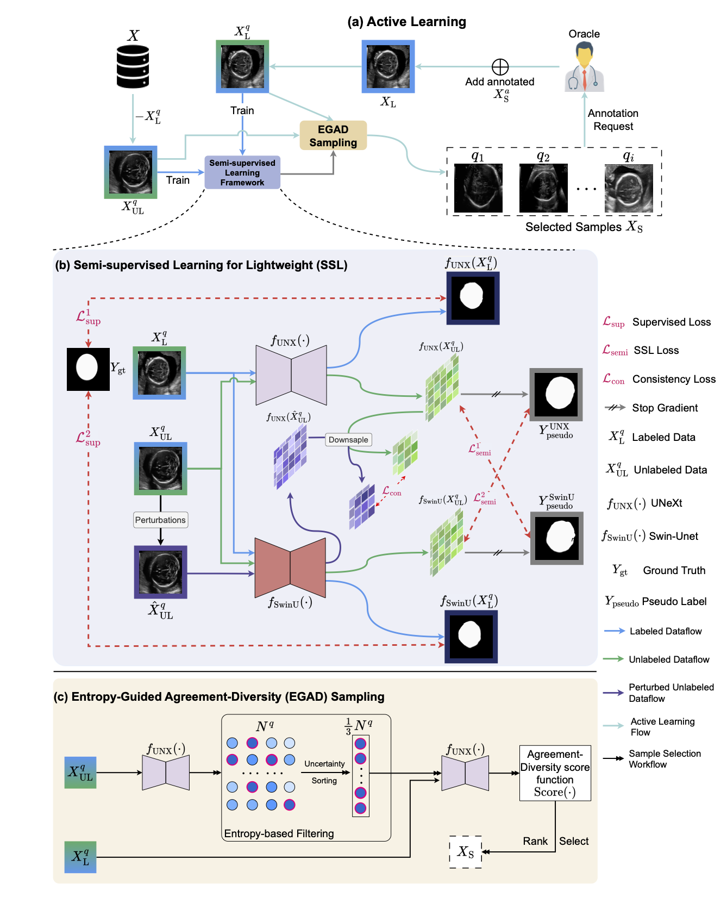

# Semi-supervised-EGAD

## Overview
This repository contains the official implementation of our paper:
> **Entropy-Guided Agreement-Diversity: A Semi-Supervised Active Learning Framework for Fetal Head Segmentation in Ultrasound**  
> Fangyijie Wang, Siteng Ma, Guenole Silvestre, Kathleen M. Curran\
> *ISBI, 2026*

**Abstract**
Fetal ultrasound (US) data is often limited due to privacy and regulatory restrictions, posing challenges for training deep learning (DL) models. While semi-supervised learning (SSL) is commonly used for fetal US image analysis, existing SSL methods typically rely on random limited selection, which can lead to suboptimal model performance by overfitting to homogeneous labeled data. To address this, we propose a two-stage Active Learning (AL) sampler, **E**ntropy-**G**uided **A**greement-**D**iversity (**EGAD**), for fetal head segmentation. Our method first selects the top 33\% most uncertain samples using predictive entropy, and then refines the final selection using the agreement-diversity score combining cosine similarity and mutual information. Additionally, our SSL framework employs a consistency learning strategy with feature downsampling to further enhance segmentation performance. In experiments, SSL-EGAD achieves an average Dice score of 94.57\% and 96.32\% on two public datasets for fetal head segmentation, using 5\% and 10\% labeled data for training, respectively. Our method outperforms current SSL models and showcases consistent robustness across diverse pregnancy stage data.

## Method Overview
### Model Framework

<p align="center">
  
</p>

**Figure:** An overview of our proposed SSL-EGAD with Swin-Unet and UNeXt for fetal US image segmentation.

## Requirements
* Python ≥ 3.11
* PyTorch ≥ 2.1
* CUDA 12.2

## Training
The active learning (AL) training scripts are available in the file `scripts/trainer.sh`. 

To train the state-of-the-art methods, please use scripts from the file `scripts/sota.sh`. 

After each AL iteration, use the scripts from the file `scripts/AL_selector.sh`. In this study, we set `AL iteration = 5`. The initial iteration always uses random selected training data with `--al_iter 0`.

## Evaluation
Use the following scripts to run testing.
```
./src/test/run_test_hc18_estt.py 
./src/test/run_test_hc18_survey.py 
./src/test/run_test_hc18.py
```

## Dataset
* HC18 
>T. L. A. van den Heuvel, D. de Bruijn, C. L. de Korte, and B. van Ginneken, ‘Automated measurement of fetal head circumference using 2D ultrasound images’, PLOS ONE, vol. 13, no. 8, pp. 1–20, 08 2018.
* ES-TCB
>M. Alzubaidi, M. Agus, M. Makhlouf, F. Anver, K. Alyafei, and M. Househ, ‘Large-scale annotation dataset for fetal head biometry in ultrasound images’, Data in Brief, vol. 51, p. 109708, 2023.

## Citation

## Acknowledgements
This work was funded by Taighde Eireann – Research Ireland through the Research Ireland Centre for Research Training in Machine Learning (18/CRT/6183).
